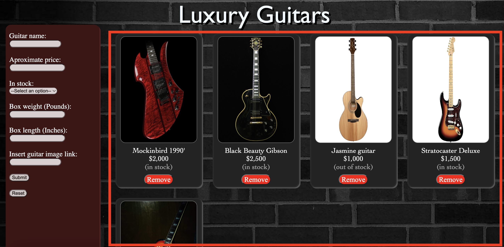

# Luxury guitars inventory

Luxury guitars inventory is a web application project that allows the user to interact with the intentory's items, allowing the user to delete items, edit stock availability, create new items, and see current item's details.

To use try this project, you just need to clone this repository, and that's it.  
`git clone https://github.com/yanakolajara/Luxury-guitars-inventory-app.git`

## Application structure

This inventory application has only 2 sections: 
The main section will allow you to see the items on the inventory, as well as some other specifications of each item:

 
The Red square section allows the user to add another item to the inventory (All inputs must be filled):

## Using the app

The main focus of this project was to made the web application as simple as possible, so that anyone can naturally understand it. Here are some things you can do:

### Red square
The red square section allows the user to create new items. It requires the user to fill all the fields.

The last field (Insert guitar image link) must be filled with a direct link of the picture of the item. If you have the picture but you don't know how to get the picrue's URL, you can check this tutorial: https://www.wikihow.com/Get-the-URL-for-Pictures#:~:text=Right%2Dclick%20the%20image.&text=If%20you're%20using%20a,or%20Copy%20Link%20menu%20option.

After filling all the fields, the user must press the `submit` button to create the item.

If user wants to clear the red square section, he can press the `reset` button.

### Main page

The main page will have all the items on the inventory, from this section, the user can do the following actions:

- See more details: By clicking and holding the picure of the item
- Remove the item: By pressing the `remove` item
- Modify it's stock availability: by taping once the `stock` text, it will switch between `(in stock)` or `(out of stock)`